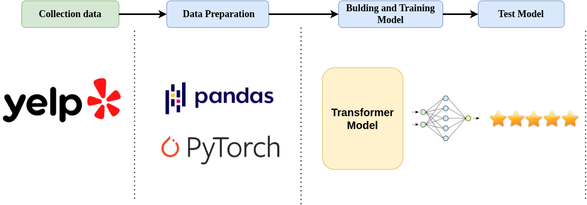
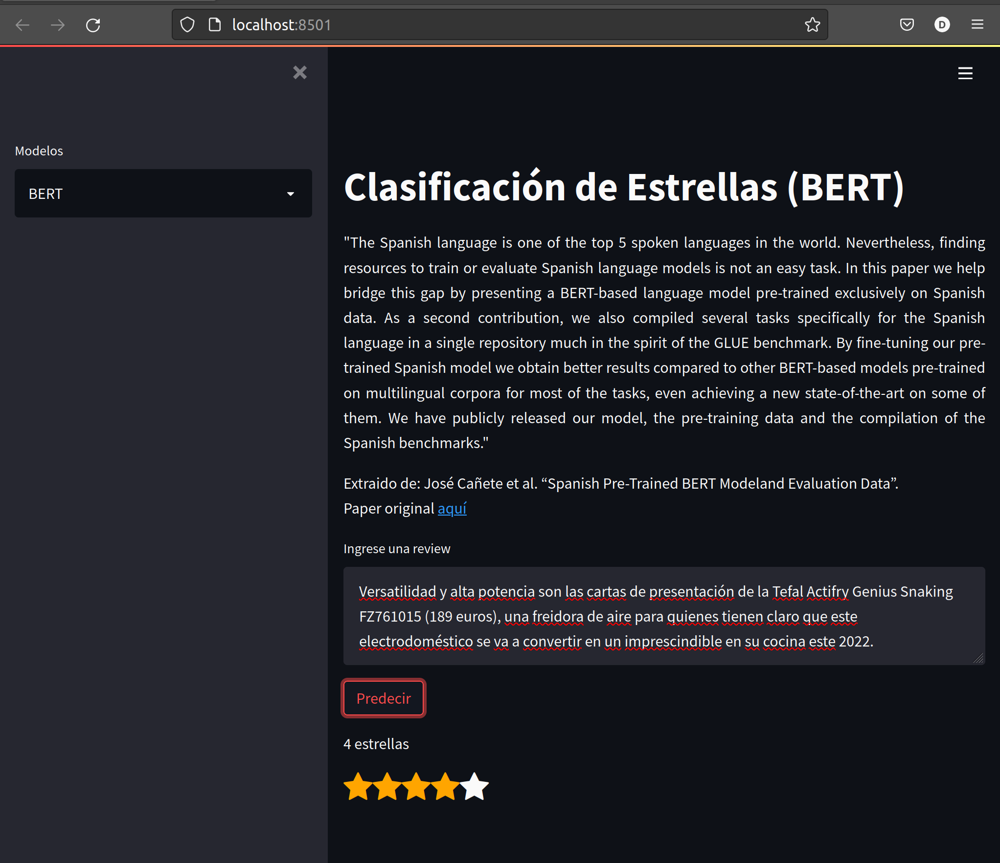

<h1>
<b>Aplicando modelos Transformers sobre la tarea de clasificación en 5 estrellas en las Reviews de Yelp</b>
</h1>

<h2><b>Resumen</b></h2>

El campo de la mineria de texto ha tenido una gran acogida en los ultimos años debido al interes de las empresas por conocer la apreciación y perseccion de sus productos por el lado de los clientes, por lo que el análisis de las opiniones de las compradores es de vital importancia, agregando que también es importante para los usuarios al decidir que producto comprar y/o recomendar, por lo que una manera entendible de poder evaluar sus opiniones es en base a la calificación de estrellas.
Teniendo presente los avances del Deep Learning en tareas como el análisis de sentimiento, detección de emociones, entre otros, en este trabajo nos enfocamos en la tarea de predicción de estrellas usando modelos de Deep Learning.
Se realizó una comparativa entre los modelos transformers más populares, donde todos los modelos fueron entrenados usando la técnica de fine tuning bajo el dataset de YELP y se obtuvo que el modelo con mejor resultado fue Beto bajo las métricas F1-score weight y Accuracy.

Puede leerlo [aquí](https://drive.google.com/file/d/13boESDzS1ewTeojNOAnzW3fN692waVyb/view?usp=sharing) 

<h2><b>Pipeline</b></h2>
Se uso el dataset de reviews de Yelp, el cual se le realizo un proceso de limpieza y se tradujo al idioma español usando el API de google translator, posteriormente se realizo el fine tuning de los modelos con el dataset pre-procesado.

     
    
     

<h2><b>Despliegue en Streamlit</b></h2>
Se ha realizado un pequeño despliegue que carga los modelos y permite ingresar los textos y realizar inferencia con cualquiera de los 4 modelos (DistilMBert, Bert, Electra y Roberta).

     
    
     

<h2><b>Autores</b></h2>

* Alexander Lique Lamas
* Diego Vásquez Lévano
* Dr. Marcos Alania 

<h2><b>Agradecimientos</b></h2>
Agradecimientos a Jose Navio por su apoyo a lo largo de estos meses y su compresión.

